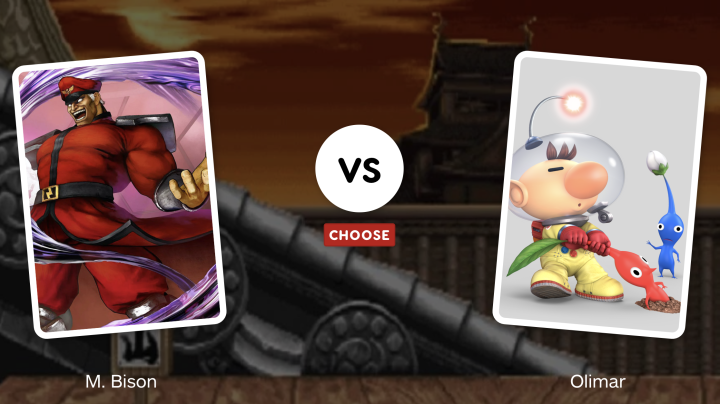

# This or That - The ultimate competition!

Visitors are presented with two (2) random spicey images and **must** vote for their preferred image.

A leaderboard is presented up-top, showcasing most-voted images.

The images are user-submitted.

- *This is a single page application btw. More info: [see below](#root)*
- *'User' refers to users with an account on the site, as opposed to 'visitor'*

Users can upload image submissions consisting of a `title` and `image-url`.
Users can see their own submissions and how they've fared (votes, wins, losses, etc.)

The app itself will be written in `expressJS` using `MongoDB` as the database, and possibly `Bootstrap` for front end styling.

## Milestones:

#### MVP 1

- It looks like it works
- Base game:
  - Anyone can vote. No limits on votes!
  - Every game is random, new image pair each vote! Non-stop action!!!!
  - Images are ranked by total lifetime votes
- Login/sessions in place. Must be logged in to submit imgs.
- Users can see list of their submissions
- Leaderboard (ranked by total votes)
- Imgs are URL only (no file uploads)
- No game tracking (for win/loss etc)
- No time-based games
- ye.

#### MVP 2

- these are extras.
- Time-based games (instead, or on-top of base game)
  - eg. every 10mins a new img-pair is played
  - everyone sees the same img pair
  - limited votes per session/user
  - Leaderboard updates periodically
  - Rank resets?
- session tracking (users)
  - user may have multiple sessions (diff browsers etc)
  - session may be used to hold db connection open until expired
  - expire the sessions
- session tracking (visitors)
  - to prevent spam-votes on the same game
- Last match's winner (Winner may not be on leaderboard)
- Leaderboard(s) by one or more of:
  - K/D
  - Matches won
  - total votes
- admin/moderator users

#### MVP 3

- turn it into Tinder Gold?

## Page Layout / components

- [root (home)](#root)
  - [leaderboard](#leaderboard)
  - [nav](#nav)
    - [about](#about)
    - [submit-image](#submit-image)
    - [signup](#signup)
    - [login](#login)
    - [logout](#logout)
  - [game](#game)

#### root

- Page elements: Leaderboard, Nav, Game
- When not logged in:
  - main elements above plus:
  - Basic Nav including About, Signin/Signup
- When logged in:
  - Above plus:
  - Nav also includes:
    - submit image
    - your submissions
    - Logout (instead of Signin/Signup)

#### about

- a simple About page explaining the concept behind the app and how to use it.
  
#### nav

- a nav dropdown or navbar with all the 'links'.
  
#### leaderboard

- image reel (could be a carousel, or keep it static)
- Shows top N images (and user who submitted it) by total votes
- could have fancy banners or size emphasis on it

#### game

- section that contains the game
- Displays two (2) randomised submissions, with the images formatted to the same size with a border (circle?) and the title (and user who submitted it?) beneath each
- Players will be able to click one of the two images to vote.
- Once an image is clicked, two more randomised images will be selected.

#### login

- sign in form submits to /api/login

#### signup

- sign in form submits to /api/signup
  
#### logout

- Deletes the cookie, logging the user out, then redirects them to the homepage.

#### submit-image

- shows a form to submit a new image URL and title via /api/post.
- (future development - allow the user to upload an image). If user is not authenticated, display 403 (forbidden)

## API routes

#### api/login (POST)

- processes the login forms by setting a cookie and redirecting to homepage

#### /api/signup (POST)

- processes the signup form by adding the user to the database, setting a cookie, then redirecting to the homepage

#### /api/submit-image (POST)

- proceses the new posts by submitting the form contents to the database then redirecting to the user's profile

#### /api/profile/:username (GET)

- shows all submissions posted by the selected user, with vote count next to it. If logged in user is the same user as this profile, then edit/delete buttons show up next to each post. Clicking delete POSTs a delete command directly to the API such as /api/del/:postid

#### /api/del/:postid (DELETE)

- process the deletion of the postID and redirect to profile page.

#### /api/leaderboard (GET)

- list of all items on the entire site, sorted by votes.

## Database

#### Users

- ID (default hashed)
- name (text)
- username (text)
- passwordhash (password)

#### Submissions

- ID (default hashed)
- PostTitle (text)
- PostImg (text) (img url)
- UserID(text) (the user who posted this item)
- Votes (Integer)
<!-- - GamesPlayed (integer) -->

#### Leaderboard

(to cache results on periodic updates instead of mass-querying each time)

- ID (default hashed)
- PostID (text)
- Rank (integer)

## Issue tracking

[Trello - Kanban](https://trello.com/invite/b/LJnpvFc9/ATTI94655a6936ba3dbafa865e6285a526050A15C2AF/this-or-that)
Pls don't mess stuff up here. We're too poor to afford premium, which is required to create a view-only link.

<!-- 

## Tools we need

- Express JS
- Mongo DB
- some other stuff
- render.com

## TODO

- set up express
- set up mongo
- connect to express
- set up a script for dummy db data for testing - a few posts etc.

## Future Enhancements

- track number of times submission is included in a vote. Can then display number of votes vs number of times included ie like a KD Ratio 
- profanity and lewd image filter

 -->
